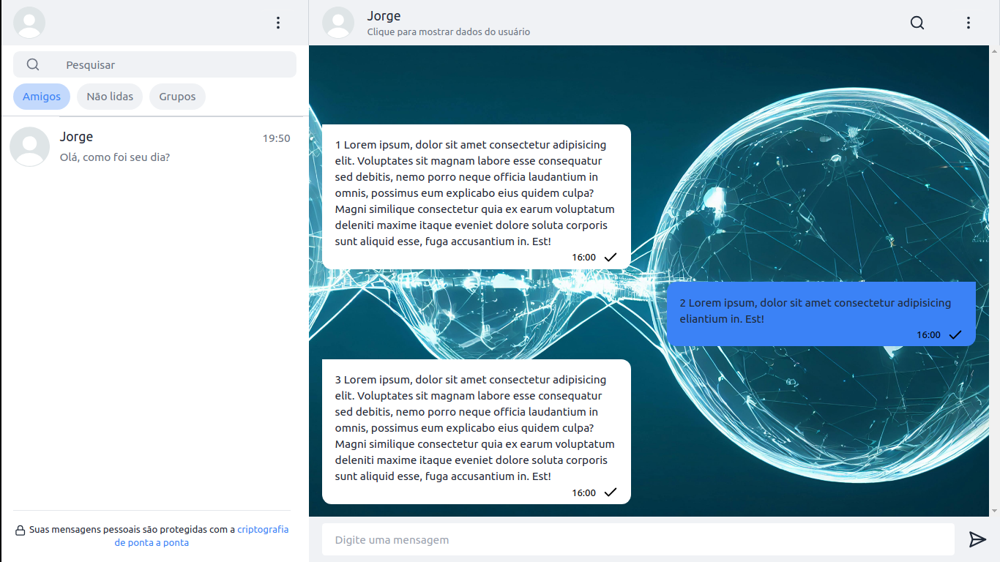

# Chat



> Website que representa um chat em tempo real estilo whatsapp, responsivo para celulares, tablets e computadores. No site você pode criar sua conta, adicionar amigos, criar grupos e o principal trocar mensagens em tempo real.


## 💻 Pré-requisitos

Antes de começar, verifique se você atendeu aos seguintes requisitos:

* Você instalou o node.
* Breve conhecimento em sistemas web`.

## 🚀 Instalando <nome_do_projeto>

Para instalar o <nome_do_projeto>, siga estas etapas nas pasta raiz da api ou spa:

#### API:
```
npm i
npx prisma init --datasource-provider sqlite
npx prisma migrate dev --name init
```

Crie um arquivo .env:
```
DATABASE_URL="file:./dev.db"
JWT_SECRET_KEY="Qualquercoisa"
```

#### SPA:
```
npm i
```
Crie um arquivo .env:
```
VITE_API="http://127.0.0.1:3000"
VITE_WEBSOCKET="ws://localhost:5173/auth/signin"
```

## ☕ Usando <nome_do_projeto>

Para usar <nome_do_projeto>, digite o seguinte comando no terminal para a api e a spa:

```
npm run dev
```
Por fim, acesse a porta da SPA no localhost no seu navegador.

Adicione comandos de execução e exemplos que você acha que os usuários acharão úteis. Fornece uma referência de opções para pontos de bônus!


## 🤝 Colaboradores


<table>
  <tr>
    <td align="center">
      <a href="#">
        <br>
        <sub>
          <b>José Henrique</b>
        </sub>
      </a>
    </td>
  </tr>
</table>

