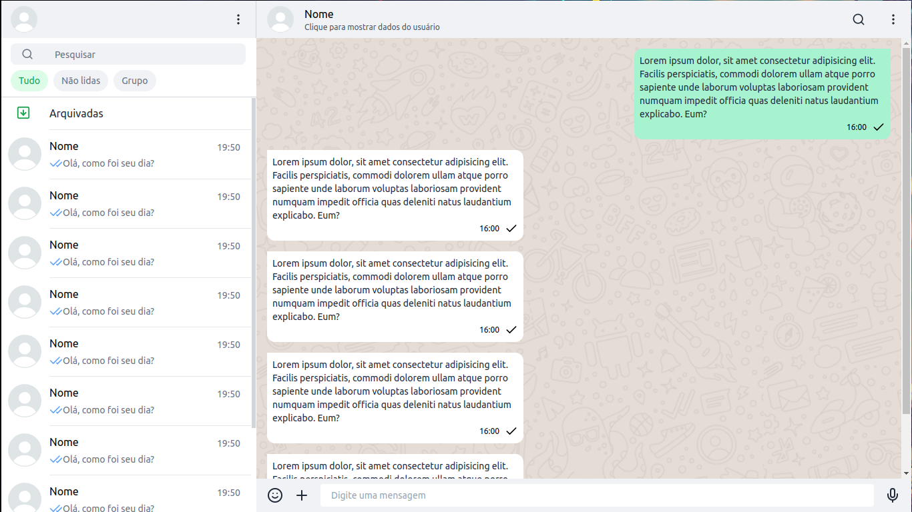

# Whatsapp Clone



> Como o próprio nome sugere, este projeto é um clone do WhatsApp Web, tendo apenas o front-end desenvolvido para aperfeiçoar minhas habilidades com React, TypeScript e Tailwind.


## 💻 Pré-requisitos

Antes de começar, verifique se você atendeu aos seguintes requisitos:

* Possuir o Node.js instalado, caso seja possivel, com a versão `v20.12.1`

## 🚀 Instalando Whatsapp Clone

Para instalar o Whatsapp Clone após ter clonado o app, siga estas etapas na raiz do projeto:


```
npm i
```


## ☕ Usando Whatsapp Clone

Para usar Whatsapp Clone, siga estas etapas:

```
npm run dev
```


## 🤝 Colaboradores


<table>
  <tr>
    <td align="center">
      <a href="#">
        <br>
        <sub>
          <b>José Henrique</b>
        </sub>
      </a>
    </td>
  </tr>
</table>


